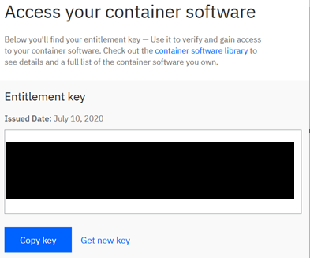

In this section we describe the installation of Watson AIOps AI Manager on IBM RedHat OpenShift Kubernetes Service (ROKS). 
This document was written based on our experience with installation on Red Hat OpenShift 4.3 running on x86 architecture.

**Important**: At the time of writing OpenShift 4.5 is the highest supported version for Watson AIOps.

## Client Workstation Environment

It is recommended to use a Linux client environment to do the installation. There are some tools that will be necessary and/or useful during install and configuration. Use the following commands to install OpenShift client and Kubernetes client. Commands below are for CentOS 7 Linux client but should also work on RHEL 7 Linux and should be run as root.

```
# install OpenShift 4 client and kubectl
curl -s -L -O https://mirror.openshift.com/pub/openshift-v4/clients/oc/latest/linux/oc.tar.gz
gunzip oc.tar.gz
tar -xf oc.tar && rm -f oc.tar
mv oc /usr/local/bin

cat <<EOF > /etc/yum.repos.d/kubernetes.repo
[kubernetes]
name=Kubernetes
baseurl=https://packages.cloud.google.com/yum/repos/kubernetes-el7-x86_64
enabled=1
gpgcheck=1
repo_gpgcheck=1
gpgkey=https://packages.cloud.google.com/yum/doc/yum-key.gpg https://packages.cloud.google.com/yum/doc/rpm-package-key.gpg
EOF

yum install -y kubectl
```

## Storage

Review the [Storage considerations](https://www.ibm.com/support/knowledgecenter/en/SSQNUZ_3.0.1/cpd/plan/storage_considerations.html) for CP4D. For AI Manager, only Portworx and IBM Cloud File Storage are supported. For production deployments, Portworx is recommended. The guide below uses IBM Cloud File Storage (ibmc-file-gold-gid storage class).

## Cloud Pak for Data (CP4D) Installation

AI Manager runs on Cloud Pak for Data v3.0.1 lite. The instructions below are based off of [the instructions for CP4D in the knowledge center](https://www.ibm.com/support/knowledgecenter/en/SSQNUZ_3.0.1/cpd/install/install.html). The CP4D install must be done using the installer. You cannot use the cloud provisioned CP4D on IBM Cloud.

[Changing required node settings](https://www.ibm.com/support/knowledgecenter/en/SSQNUZ_3.0.1/cpd/install/node-settings.html) should not be necessary for AI Ops installation. This is good because these changes require root access to the cluster nodes which is very difficult on OCP 4.x.

### [Setting up your registry server](https://www.ibm.com/support/knowledgecenter/en/SSQNUZ_3.0.1/cpd/install/registry_server.html)

Use the RHOCP internal registry. [Expose the registry](https://docs.openshift.com/container-platform/4.3/registry/securing-exposing-registry.html) by running the following:

    oc patch configs.imageregistry.operator.openshift.io/cluster --patch '{"spec":{"defaultRoute":true}}' --type=merge

### [Obtaining the installation files](https://www.ibm.com/support/knowledgecenter/en/SSQNUZ_3.0.1/cpd/install/installation-files.html)

Obtain your entitlement license API key from the [Container software library on My IBM](https://myibm.ibm.com/products-services/containerlibrary) and your IBM ID.

On the Get entitlement key tab, select Copy key to copy the entitlement key to the clipboard and save the API key in a text file for use in repo.yaml later during the install process.



On the Linux workstation, download and extract the Enterprise installer from [cpd-cli GitHub](https://github.com/IBM/cpd-cli/releases) using the following command:

    curl -L -o cloudpak4data-ee-3.0.1.tgz https://github.com/IBM/cpd-cli/releases/download/cpd-3.0.1/cloudpak4data-ee-3.0.1.tgz
    tar -xvf cloudpak4data*.tgz

The OpenShift 4.x client install was already done above.

Edit the extracted ``repo.yaml`` server definition file use the following values:

| Parameter    | Value       |
|:--------------| :-------------|
| username | Specify `cp` |
| apikey | Specify your entitlement license API key |

The `repo.yaml` file should look similar to the sample below, with the `apikey` value reflecting the entitlement license key obtained above:

```
registry:
  - url: cp.icr.io/cp/cpd
    username: cp
    apikey: BsiVF7vsOjkgyu1lFngf.eyJrc3MiOiJJQk0gTWFya2V0cGxhY2yiLCJpYXQiOjE1OTQzOTI3MEcsImp0aSI6ImFhNWEwMTExMzQyMDRkMDk4YmY4NDM0MzE0OTFiMTJhIn0.ulLvxhYELQRhR54OKvYeSSoqN9oTradJh5ksGaWPXFA
    name: base-registry
fileservers:
  - url: https://raw.github.com/IBM/cloud-pak/master/repo/cpd3
```

### [Setting up your environment](https://www.ibm.com/support/knowledgecenter/en/SSQNUZ_3.0.1/cpd/install/service_accts.html)

Log in to your Red Hat OpenShift cluster:  
`oc login OpenShift_URL:port`

Set namespace environment variable, sample uses `zen` namespace:  
`export NAMESPACE=zen`

Do not run the preview command leaving off the `--apply` parameter. There is a bug in the installer that will cause problems if the setup command is run without `--apply`.

Make the necessary changes to the cluster by running the following command:

```
./bin/cpd-linux adm --repo repo.yaml \
--assembly lite \
--accept-all-licenses \
--namespace $NAMESPACE \
--apply
```

*Important*: Run the following command to grant cpd-admin-role to the project administration user(s):

    oc adm policy add-role-to-user cpd-admin-role $(oc whoami) --role-namespace=$NAMESPACE -n $NAMESPACE

### [Installing on an OpenShift cluster](https://www.ibm.com/support/knowledgecenter/en/SSQNUZ_3.0.1/cpd/install/rhos-install.html)

Change to the project where you will install the Cloud Pak for Data control plane, samples uses `zen` namespace:

    oc project zen

*Important*: The documentation includes a “dry run” to preview the install command, but if you run the preview before running the install, then the install will hang. This is a known bug, so skip the preview “dry run”.

Note that IBM Cloud File Storage (ibmc-file-gold-gid storage class) is used.

Run the following command to install the Cloud Pack for Data control plane:

```
bin/cpd-linux --repo ./repo.yaml \
--assembly lite \
--namespace $NAMESPACE \
--storageclass ibmc-file-gold-gid \
--transfer-image-to $(oc get route/default-route -n openshift-image-registry --template='{{ .spec.host }}')/$NAMESPACE \
--cluster-pull-prefix image-registry.openshift-image-registry.svc:5000/$NAMESPACE \
--target-registry-username $(oc whoami) \
--target-registry-password $(oc whoami -t) \
--accept-all-licenses \
--insecure-skip-tls-verify
```

### Updating the Nginx Certificate

The Nginx pods need the certificate updated or else there will be problems bringing up the UI and when configuring Slack integration. The following commands will take the valid certificate from OpenShift and apply it to the Nginx pods. Keep in mind that this certificate expires every 3 months, so this will need done again in the future.

```
oc get secrets -n openshift-ingress | grep tls | grep -v router-metrics-certs-default | awk '{print $1}' | xargs oc get secret -n ibm-cert-store -o yaml > tmpcert.yaml
cat tmpcert.yaml | grep tls.crt | awk '{print $2}' |base64 -d > cert.crt
cat tmpcert.yaml | grep tls.key | awk '{print $2}' |base64 -d > cert.key
ibm_nginx_pod=$(oc get pods -l component=ibm-nginx -o jsonpath='{ .items[0].metadata.name }')
oc exec ${ibm_nginx_pod} -- mkdir -p "/user-home/_global_/customer-certs"
oc cp cert.crt ${ibm_nginx_pod}:/user-home/_global_/customer-certs/
oc cp cert.key ${ibm_nginx_pod}:/user-home/_global_/customer-certs/
for i in `oc get pods -l component=ibm-nginx -o jsonpath='{ .items[*].metadata.name }' `; do oc exec ${i} -- /scripts/reload.sh; done
rm tmpcert.yaml cert.crt cert.key
```

Sample output from the above commands:

```
reloading nginx conf
setting up ssl
using customer certs
nginx: the configuration file /usr/local/openresty/nginx/conf/nginx.conf syntax is ok
nginx: configuration file /usr/local/openresty/nginx/conf/nginx.conf test is successful
2020/09/24 18:04:52 [notice] 211#211: signal process started
reloading nginx conf
nginx: the configuration file /usr/local/openresty/nginx/conf/nginx.conf syntax is ok
nginx: configuration file /usr/local/openresty/nginx/conf/nginx.conf test is successful
setting up ssl
using customer certs
2020/09/24 18:04:57 [notice] 112#112: signal process started
reloading nginx conf
setting up ssl
using customer certs
nginx: the configuration file /usr/local/openresty/nginx/conf/nginx.conf syntax is ok
nginx: configuration file /usr/local/openresty/nginx/conf/nginx.conf test is successful
2020/09/24 18:05:03 [notice] 44#44: signal process started
```

## AI Manager Installation

### Install Strimzi for Kafka

The [documentation](https://www.ibm.com/support/knowledgecenter/en/SSQNUZ_3.0.1/svc-aiops/aiops-prereqs.html) describes how to install the Strimzi operator in order to get Kafka. The install can be done via the command line using the following command:

```
cat <<EOF | oc create -f -
apiVersion: operators.coreos.com/v1alpha1
kind: Subscription
metadata:
  name: strimzi-kafka-operator
  namespace: openshift-operators
spec:
  channel: stable
  name: strimzi-kafka-operator
  source: community-operators
  sourceNamespace: openshift-marketplace
EOF
```

### [Preparing the cluster for Watson AIOps AI Manager](https://www.ibm.com/support/knowledgecenter/en/SSQNUZ_3.0.1/svc-aiops/aiops-svc-adm-cmd.html)

Label the namespace using the `NAMESPACE` environment variable set above:

```
oc label --overwrite namespace $NAMESPACE ns=$NAMESPACE
```

Do not run the preview command leaving off the `--apply` parameter. There is a bug in the installer that will cause problems if the setup command is run without `--apply`.

Make the necessary changes to the cluster by running the following command:

```
bin/cpd-linux adm --repo repo.yaml --accept-all-licenses --assembly watson-aiops --namespace $NAMESPACE --apply
```

### [Installing the Watson AIOps AI Manager service](https://www.ibm.com/support/knowledgecenter/en/SSQNUZ_3.0.1/svc-aiops/aiops-install.html)

Create an `override.yaml` file and configure it to turn on the Strimzi resources creation and include updates to tune up the liveness/readiness probes for Postgres because we are using slower IBM Cloud storage as opposed to Portworx.

```
global:
  kafka:
    strimzi:
      enabled: true
postgres:
  livenessProbe:
    initialDelaySeconds: 300
    timeoutSeconds: 15
    failureThreshold: 5
    periodSeconds: 15
    successThreshold: 1
  readinessProbe:
    initialDelaySeconds: 300
    timeoutSeconds: 15
    failureThreshold: 5
    periodSeconds: 15
    successThreshold: 1
  keeper:
    resources:
      requests:
        cpu: "100m"
        memory: "256Mi"
      limits:
        cpu: "500m"
        memory: "512Mi"
  sentinel:
    resources:
      requests:
        cpu: "100m"
        memory: "256Mi"
      limits:
        cpu: "500m"
        memory: "512Mi"
```

*Important*: The documentation includes a “dry run” to preview the install command, but if you run the preview before running the install, then the install will hang. This is a known bug, so skip the preview “dry run”.

Note that IBM Cloud File Storage (ibmc-file-gold-gid storage class) is used.

```
bin/cpd-linux --repo ./repo.yaml \
--assembly watson-aiops \
--namespace $NAMESPACE \
--instance waiops \
--storageclass ibmc-file-gold-gid \
--transfer-image-to $(oc get route/default-route -n openshift-image-registry --template='{{ .spec.host }}')/$NAMESPACE \
--cluster-pull-prefix image-registry.openshift-image-registry.svc:5000/$NAMESPACE \
--target-registry-username $(oc whoami) \
--target-registry-password $(oc whoami -t) \
--accept-all-licenses \
--insecure-skip-tls-verify \
--override override.yaml
```

Congratulations, you have successfully installed Watson AIOps AI Manager.
