In this section we describe the configuration of Slack for Watson AIOps AI Manager on IBM RedHat OpenShift Kubernetes Service (ROKS). 
This document was written based on our experience configuring Slack for AI Manager on Red Hat OpenShift 4.3 running on x86 architecture.

These instructions assume that AI manager is installed on a public cloud that can access Slack enterprise servers directly.

## Contact Slack Workspace Administrator

If you are not the workspace administrator for the target Slack workspace, it will be helpful to find an administrator and give them a heads up that you will be requesting a Slack app for approval. To find the administrators for the workspace, click the **People & user groups** button (might be hidden under More) on the top left.

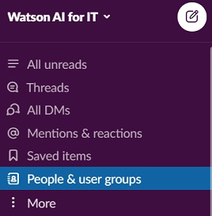 

Filter by **Account type = Workspace admins** to find the administrators for the workspace.

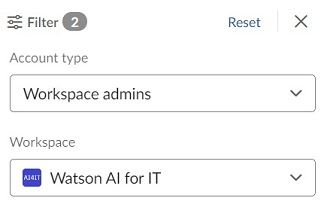

## Create Slack App

Create a Slack app, by going to [https://api.slack.com/apps](https://api.slack.com/apps) and clicking **Create New App**. In the pop-up dialog, enter an App Name and specify which Workspace it will be connected to and then click Create App.

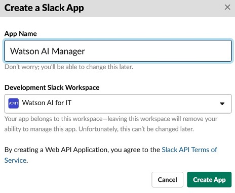

On the OAuth & Permissions page, select **Scopes** and verify that the following **Bot Token Scopes** have been added: `app_mentions:read`, `channels:manage`, `groups:write`, `chat:write`, `files:write`, `users:read`, `groups:read`, and `channels:read`.

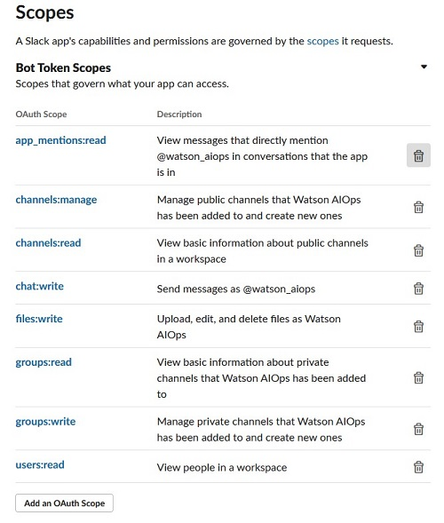

The next step is to install the Slack app. If you are not a Slack workspace administrator, then you will need to request to install the Slack app. On the OAuth & Permissions page, scroll to the top section called **OAuth Tokens & Redirect URLs**. Click **Request to Install**. In the pop-up dialog, write a description and click **Submit Request**.

After submitting the request to install, a Slack workspace administrator must approve. Until that approval is given, the following is shown for **OAuth Tokens & Redirect URLs**.

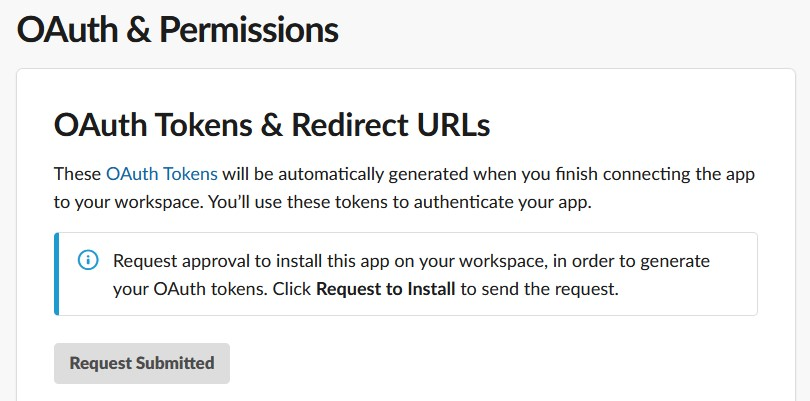

Contact a workspace administrator (see instructions above on finding one) to approve. 

During the approval process, a governance bot may message you in Slack if there are additional processes required for approval.

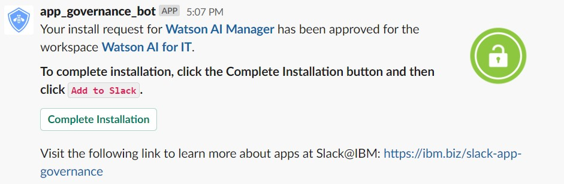

Follow any additional processes for your organization and/or workspace.

Once approval is complete, the OAuth Tokens & Redirect URLs section will display **Install App to Workspace**.

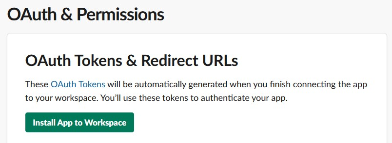

Click **Install App to Workspace**. In the pop-up dialog, review the information and click **Allow**.

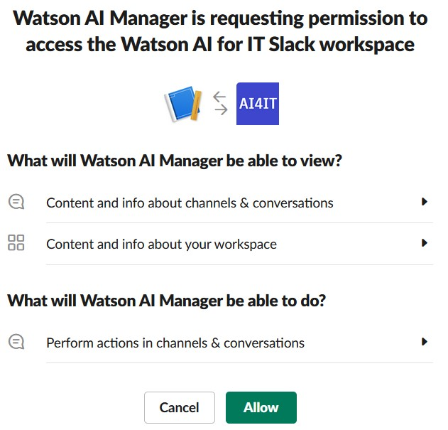

The **Bot User OAuth Access Token** that will be needed to configure the Slack integration in AI Manager is now shown. Copy this token and save it.

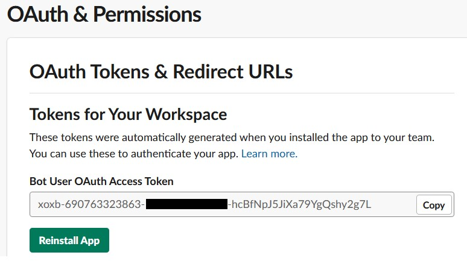

On the Basic Information page, select **App Credentials** and note the *Signing Secret* value. Copy this secret and save it. It will also be needed to configure the Slack integration in AI Manager.

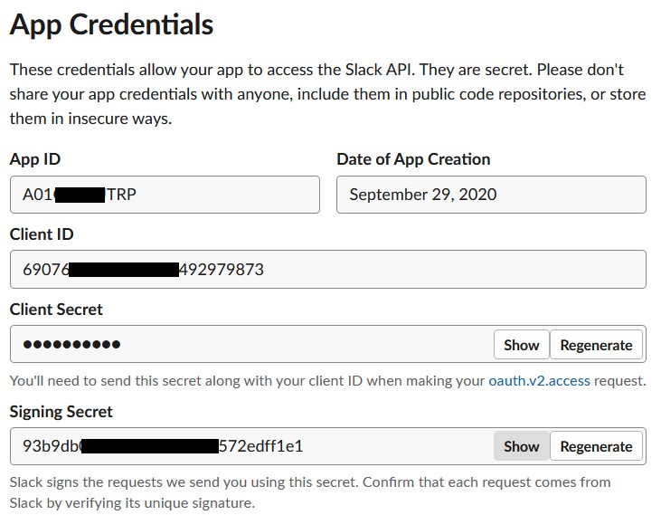

## Define Slack Integration in AI Manager

Open a new browser tab and log in to AI Manager. If AI Manager is newly installed, you will be prompted to create the ChatOps Integration. Alternatively, select the **Ops integration** tab and create a ChatOps Integration. Fill out the form with the token and secret from above and click **Create Integration**.

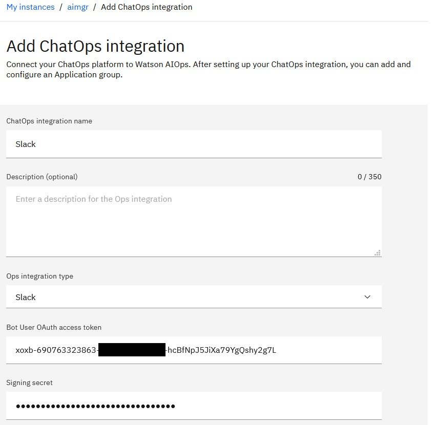

After creation, the Ops Integration will be shown with the proper Request URL. Save this URL as it is needed to further configure the Slack app.

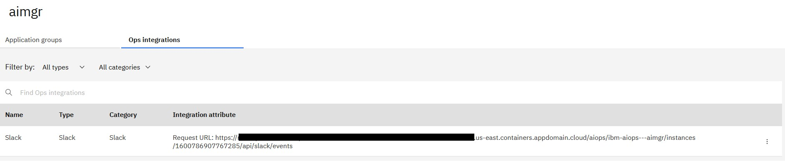

Sample Request URL:
```
https://zen-cpd-zen.dteaiops0705201-4b4a324f237aea19c5cbc0c3276d4656-0000.us-east.containers.appdomain.cloud/aiops/ibm-aiops---aimgr/instances/1600786907767285/api/slack/events
```

## Configure Slack App Communications

Return to the browser tab for the Slack app. Under **Features**, select **Event Subscriptions**. In the Enable Events section, click the slider to enable events. For the **Request URL** field use the Request URL value obtained from AI Manager above. After pasting the value in the field, a “Verified” message should display.

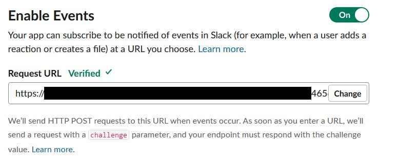

If the URL verification fails, ensure that SSL certificates are properly configured for AI Manager. Instructions for accomplishing this are in the [installation section titled Updating the Nginx Certificate](../install/#updating-the-nginx-certificate).

On the **Subcribe to bot events** section, add `app_mention` and `member_joined_channel` events.

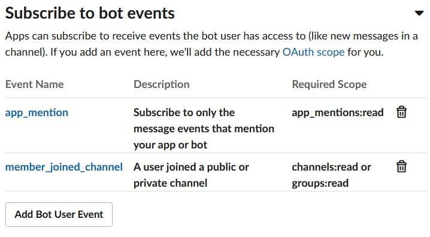

Click **Save Changes** button.

Under **Features**, select **Interactivity & Shortcuts**. In the Interactivity section, click the slider to enable interactivity. For the **Request URL** field use the Request URL value obtained from AI Manager above. There is no automatic verification for this form.

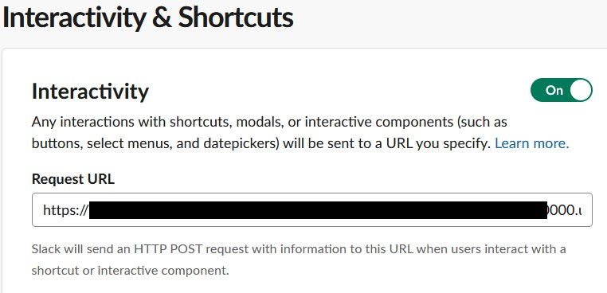

Click **Save Changes** button.

Now, configure the welcome slash command. With this command, you can trigger the welcome message again if you closed it. Under *Features*, click **Slash Commands**, then click **Create New Command** to create a new slash command. Use the following values:

Command: `/waiops-welcome`  
Request URL: `<Request URL value obtained from AI Manager above>`  
Short Description: `Welcome to Watson AIOps`  

Note that the value of the slash command `/waiops-welcome` is hard-coded in AI Manager. However, slash commands are unique within a Slack workspace, so two distinct Slack apps cannot use the same slash command in one workspace. If you are adding an additional AI Manager Slack app to a workspace that already has another AI Manager Slack app, you will need to use a different slash command and reconfigure AI Manager to expect the different slash command.

For example, if you use `/waiops-aimgr-welcome` as the Command, then you can reconfigure AI Manager using the OpenShift CLI with the command:
```
oc set env deployment/$(oc get deploy -l app.kubernetes.io/component=chatops-slack-integrator -o jsonpath='{.items[*].metadata.name }') SLACK_WELCOME_COMMAND_NAME=/waiops-aimgr-welcome
```

After filling out the form for the slash command according to your environment, click **Save**.


The Slack app must be reinstalled, as several permissions have changed. Under Settings, go to **Install App** and click **Request to Install** (if you are Slack workspace admin then click Reinstall App). A workspace administrator must approve the re-install due to the permissions changing.

Once the workspace request is approved, the Slack integration is complete. At this point it is possible to add the Slack app to a channel and test basic communication.

## Configuring Slack Channel

You can use an existing Slack channel or create a new Slack channel. A sample channel is shown here named `#watson-aiops-aimgr` and is made private (invitation only).

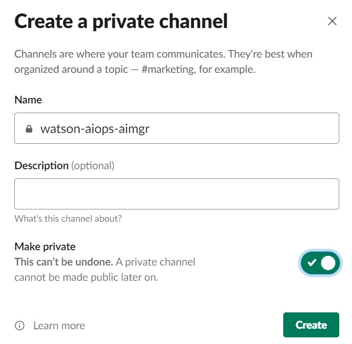

Capture the channel ID by right-clicking on the channel name, the select **Copy Link** to get the web URL link. The last part of the link is the channel ID, starting with C for public channels or G for private channels.

Example: `https://watsonaiforit.slack.com/archives/G017SA7NQ9L`

Channel ID for example above is `G017SA7NQ9L`. Save this ID to use for further configuration in AI Manager.

## Configuring an Application Group with a Slack Channel

Switch back to AI Manager in your browser. On the instance page, click **Create new application group**. Name the application group and set the **Platform channel ID** to the value of your Slack channel ID saved earlier.

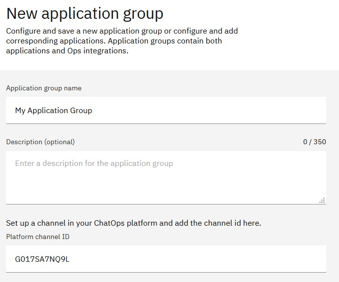

Click **Save application group**. Now all the applications added to this application group will target the Slack channel created earlier.

## Invite the Slack app to the Channel

At this point it is possible to add the Slack app to a channel and test basic communication. Open the Slack channel created previously and tag the application in a message.

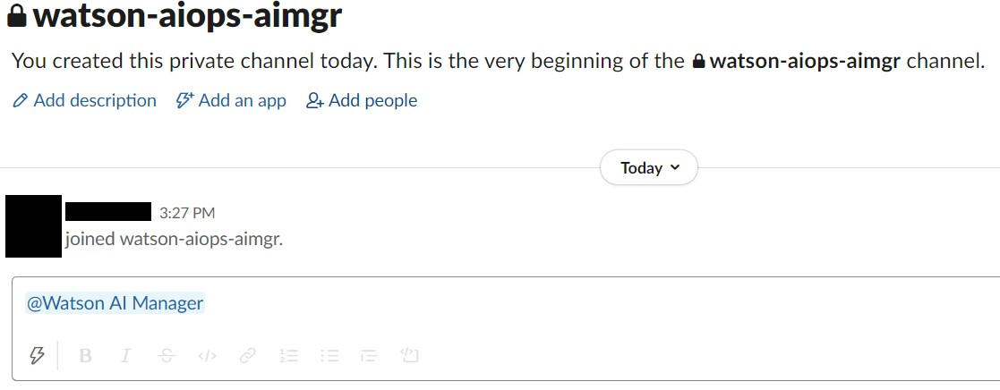

A dialog will display allowing an invitation to the Slack app.

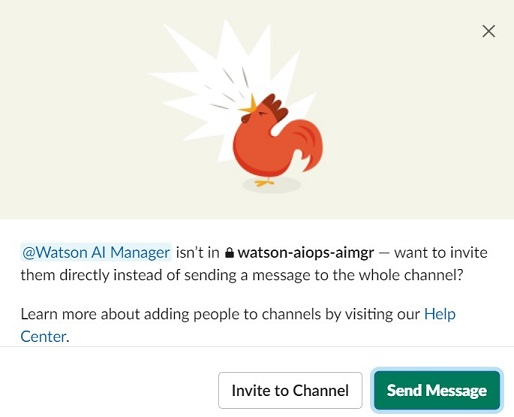

Click **Invite to Channel**.

The Slack app will send a message to the channel.


You can also show the welcome message any time by using the slash command configured for the Slack app.

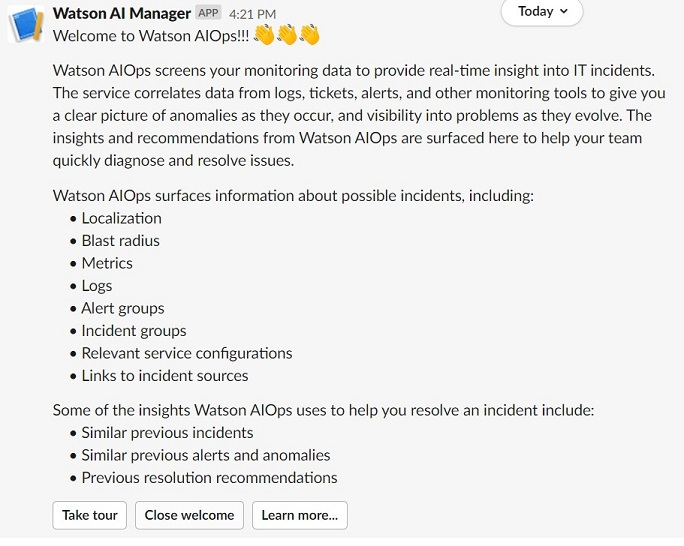

Congratulations, you have configured a Slack app for communication with AI Manager!

