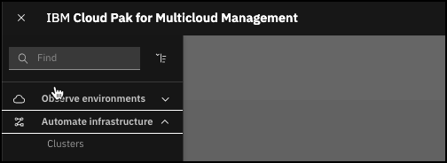
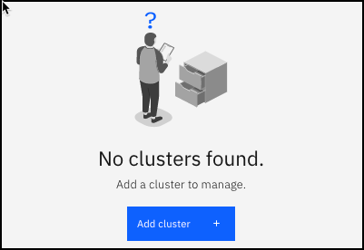
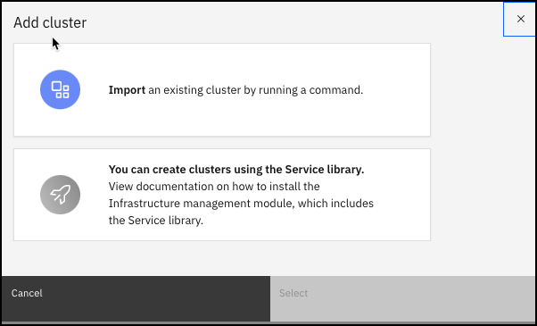
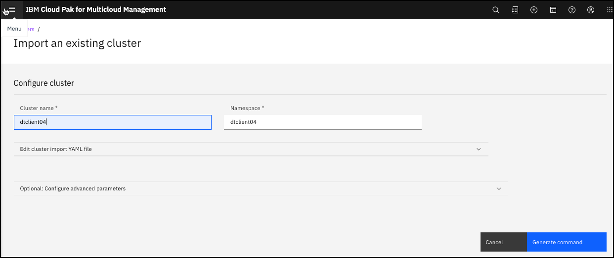
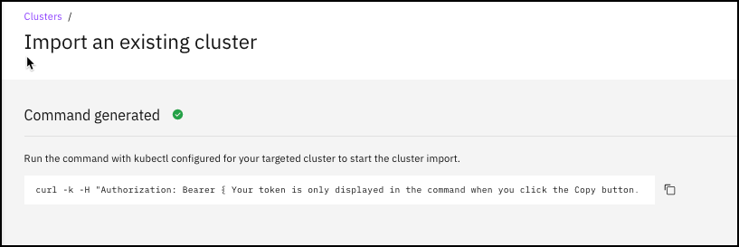
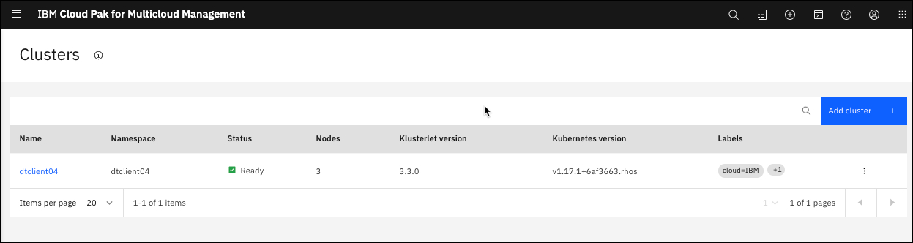

## Importing an OpenShift or other Kubernetes Cluster

1. To add a new cluster, go to the **Cloud Pak Console**.

2. Using the menu in the top-left corner, navigate to **Automate Infrastructure** > **Clusters**.

   

3. Select **Add cluster  +**.

   

4. Select **Import an existing cluster by running a command**, then click **Import**.

   

5. Enter the cluster name for `Cluster name`. The `Namespace` field auto-populates with the same name.

   

6. Click **Generate Command** button to get the configuration command. A `curl` command is
generated for you to run from your managed cluster. Click the "Copy" icon to copy the command
into your buffer.

   

7. Go to a command line where you are logged into the cluster you want to manage.
Run the command copied from the above. Your output should look something like this:

   ```bash
     % Total    % Received % Xferd  Average Speed   Time    Time     Time  Current
                                    Dload  Upload   Total   Spent    Left  Speed
   100  5643    0  5643    0     0   4941      0 --:--:--  0:00:01 --:--:--  4945
   customresourcedefinition.apiextensions.k8s.io/endpoints.multicloud.ibm.com created
   namespace/multicluster-endpoint created
   secret/klusterlet-bootstrap created
   serviceaccount/ibm-multicluster-endpoint-operator created
   clusterrolebinding.rbac.authorization.k8s.io/ibm-multicluster-endpoint-operator created
   deployment.apps/ibm-multicluster-endpoint-operator created

   ```

8. Run the same command again if the error below occurs:

   ```bash
   error: unable to recognize "STDIN": no matches for kind "Endpoint" in version "multicloud.ibm.com/v1beta1"
   ```

9. The cluster import will show as "Pending" for a few minutes but should then show up in your Clusters
   view.

