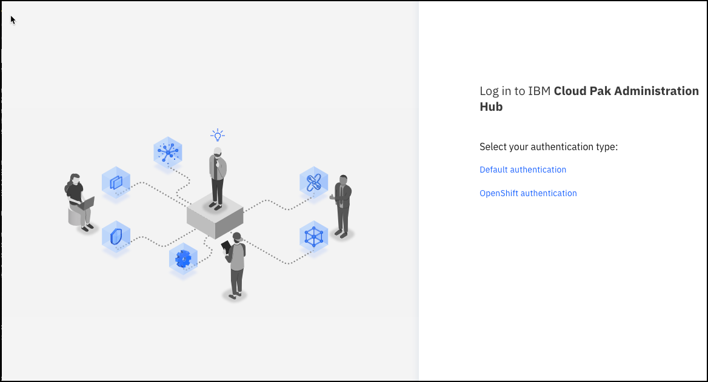
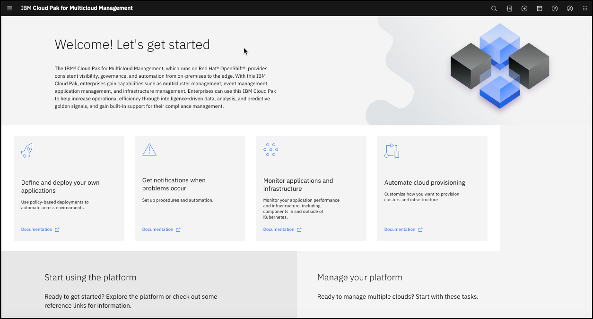

This section describes the installation of the core components of Cloud
Pak for Multicloud Management 2.0. This version is supported on OpenShift
4.3 or 4.4 at the time of this update. Please continue to check the 
[IBM Knowledge Center](https://www.ibm.com/support/knowledgecenter/SSFC4F_2.0.0/install/supported_os.html)
documentation in case this has changed before your installation. The Cloud
platform used to test and document the installation here is OpenShift on 
IBM Cloud (ROKS), specifically an OpenShift 4.4 cluster. However, since 
OpenShift 4.3. and 4.4 are available on a variety of platforms, the 
instructions should be valid on whatever on-premise or cloud platform 
where you are running OpenShift supported versions.

The installation of the Cloud Pak is well documented in the 
[IBM Knowledge Center](https://www.ibm.com/support/knowledgecenter/en/SSFC4F_2.0.0/install/online_install.html).
The installation process documented there uses a mix of the Openshift UI 
and the command line. You will be successful by carefully following
[these instructions](https://www.ibm.com/support/knowledgecenter/en/SSFC4F_2.0.0/install/online_install.html).

As an alternative, this section of the Cloud Pak Playbook describes an 
installation exclusively using the command line. With this approach, it 
is possible to automate the installation by incorporating these commands
into shell scripts.

<InlineNotification>

The syntax of the
commands in this description was correct at the time of writing. 
However, command syntax often changes over time for various reasons.
If you 
experience a command syntax error, please check the IBM Knowledge Center
or Red Hat OpenShift documentation for the latest syntax and adjust 
accordingly. If thtat does
not solve the problem, the authors of this section will respond on a best
efforts basis if you 
[open a github issue](https://github.com/ibm-cloud-architecture/cloudpak8s/issues).

</InlineNotification>

<AnchorLinks>
  <AnchorLink>Preparing your installation</AnchorLink>
  <AnchorLink>Online Installation</AnchorLink>
  <AnchorLink>Offline Installation</AnchorLink>
  <AnchorLink>Uninstall</AnchorLink>
</AnchorLinks>

## Prerequisites

This document does not describe how to install or configure the 
underlying OpenShift cluster. Prior to installing, make sure you have 
a working OpenShift cluster with the [required capacity](/mcm/requirements/).

- For online installs make sure you have an entitlement key from 
[MyIBM Container Software Library](https://myibm.ibm.com/products-services/containerlibrary)
to access the installation images. Log in to this site with your IBMid. You can then
copy your entitlement key into your buffer. It will be required during the installation.
- The installation is performed from the Command line (CLI) so you will 
need the required OpenShift CLI tools to interface with the cluster. The current OpenShift
command line can be downloaded from 
[this site](https://mirror.openshift.com/pub/openshift-v4/clients/).
- Offline installation will require the docker client install on the 
installation server

<ul>
</ul>

## Overall Installation Process

The major advancement and difference in the Cloud Pak for Multicloud Management 2.0 product is
that the installation is now performed by OpenShift operators. These operators are responsible
for the initial installation of the product components, and for the ongoing health, care and 
feeding of those components.

The cluster used for this example installation has 5 worker nodes, each with 16 vCPUs and
64 GBs memory. As stated before, it is running on the Red Hat OpenShift on IBM Cloud (ROKS) public
cloud. 

## Online Installation

In the online installation, we will first set up a number of environment variables, then install
IBM Common Services, and finally install the Cloud Pak for Multicloud Management core components.

### **Set up necessary Environment variables**

1. Log in to 
[MyIBM Container Software Library](https://myibm.ibm.com/products-services/containerlibrary) 
with your IBMid and password.
In the Entitlement keys section, copy the entitlement key to your buffer.

2. In your command line, paste this entitlement key into an environment variable.

```bash
export ENTITLED_REGISTRY_KEY="<Paste Your Entitlement Key>"
```

3. Define the other environment variables you will need for the core MCM component installation.

```bash
export ENTITLED_REGISTRY="cp.icr.io"
export ENTITLED_REGISTRY_SECRET="ibm-management-pull-secret"
export DOCKER_EMAIL="<Your Docker ID email>"
export CP4MCM_NAMESPACE="cp4m"
export CP4MCM_BLOCK_STORAGECLASS="ibmc-block-gold"
export CP4MCM_FILE_STORAGECLASS="ibmc-file-gold"
export CP4MCM_FILE_GID_STORAGECLASS="ibmc-file-gold-gid"
```

The value of `ENTITLED_REGISTRY` points to IBM's registry containing the software images. The values
of the `ENTITLED_REGISTRY_SECRET` and `CP4MCM_NAMESPACE` are arbitrary. You can use different 
values if you want. The `...STORAGECLASS` variables are populated based on the storage classes
available in the OpenShift cluster. The storage classes you have available will vary based on
the platform on which you are running your MCM OpenShift cluster. 
To find the available storage classes in your cluster, enter 
the command `oc get sc`.

4. Go to your OpenShift Cluster UI, and log in to your cluster. From the pull-down menu in 
the top right corner, click `Copy Login Command`, then click `Display Token`. Copy the command
line under `Log in with this token`, paste it into your command line and Enter to log in to your 
cluster. The command line is in the form:

```bash
oc login --token=<your_token> --server=<SERVER_URL>
```

### **Import the CatalogSource for IBM Common Services**

<InlineNotification>
For each of the commands in the following sections, it is recommended to wait a length of
time for each of these commands to fully complete before moving on to the next one. From 
our experience, we recommend a wait time of 3 minutes from the return of one command to
when you should enter the next command.
</InlineNotification>

4. Enter the following command:

```bash
oc create -f - <<EOF
apiVersion: operators.coreos.com/v1alpha1
kind: CatalogSource
metadata:
  name: opencloud-operators
  namespace: openshift-marketplace
spec:
  displayName: IBMCS Operators
  publisher: IBM
  sourceType: grpc
  image: docker.io/ibmcom/ibm-common-service-catalog:latest
  updateStrategy:
    registryPoll:
      interval: 45m
EOF
```

   You should see the following response.

   ```
   catalogsource.operators.coreos.com/opencloud-operators created
   ```

### **Import the CatalogSource for Cloud Pak for Multicloud Management**

5. Create tne namespace for CP for MCM.

```bash
oc new-project $CP4MCM_NAMESPACE
```

6. Create the entitled registry secret for the installation.

```bash
oc create secret docker-registry $ENTITLED_REGISTRY_SECRET --docker-username=cp --docker-password=$ENTITLED_REGISTRY_KEY --docker-email=$DOCKER_EMAIL --docker-server=$ENTITLED_REGISTRY -n $CP4MCM_NAMESPACE
```

7. Import the CatalogSource for CloudPak for Multicloud Management.

```bash
oc create -f - <<EOF
apiVersion: operators.coreos.com/v1alpha1
kind: CatalogSource
metadata:
  name: management-installer-index
  namespace: openshift-marketplace
spec:
  displayName: CP4MCM Installer Catalog
  publisher: IBM CP4MCM
  sourceType: grpc
  image: quay.io/cp4mcm/cp4mcm-orchestrator-catalog:2.0.0
  updateStrategy:
    registryPoll:
      interval: 45m
  secrets:
   - $ENTITLED_REGISTRY_SECRET
EOF
```

   You should see a response like this.

   ```bash
   catalogsource.operators.coreos.com/management-installer-index created
   ```

### **Create the Cloud Pak for MCM Subscription**

8. Enter the following command to create the subscription for Cloud Pak for MCM.

```bash
cat << EOF | oc apply -f -
apiVersion: operators.coreos.com/v1alpha1
kind: Subscription
metadata:
  name: ibm-management-orchestrator
  namespace: openshift-operators
spec:
  channel: 2.0-stable
  installPlanApproval: Automatic
  name: ibm-management-orchestrator
  source: management-installer-index
  sourceNamespace: openshift-marketplace
  startingCSV: ibm-management-orchestrator.v2.0.0
EOF
```

   You should see a response like this.

   ```bash
   subscription.operators.coreos.com/ibm-management-orchestrator created
   ```

### **Create the Cloud Pak for MCM Core Components Installation**

9. Enter the following command to trigger the operator to install Cloud Pak for MCM.

```bash
cat << EOF | oc apply -f -
apiVersion: orchestrator.management.ibm.com/v1alpha1
kind: Installation
metadata:
  name: ibm-management
  namespace: $CP4MCM_NAMESPACE
spec:
  storageClass: $CP4MCM_BLOCK_STORAGECLASS
  imagePullSecret: $ENTITLED_REGISTRY_SECRET
  license:
    accept: true
  mcmCoreDisabled: false
  pakModules:
    - config:
        - enabled: true
          name: ibm-management-im-install
          spec: {}
        - enabled: true
          name: ibm-management-infra-grc
          spec: {}
        - enabled: true
          name: ibm-management-infra-vm
          spec: {}
        - enabled: true
          name: ibm-management-cam-install
          spec: {}
        - enabled: true
          name: ibm-management-service-library
          spec: {}
      enabled: false
      name: infrastructureManagement
    - config:
        - enabled: true
          name: ibm-management-monitoring
          spec:
            operandRequest: {}
            monitoringDeploy:
              global:
                environmentSize: size0
                persistence:
                  storageClassOption:
                    cassandrabak: none
                    cassandradata: default
                    couchdbdata: default
                    datalayerjobs: default
                    elasticdata: default
                    kafkadata: default
                    zookeeperdata: default
                  storageSize:
                    cassandrabak: 50Gi
                    cassandradata: 50Gi
                    couchdbdata: 5Gi
                    datalayerjobs: 5Gi
                    elasticdata: 5Gi
                    kafkadata: 10Gi
                    zookeeperdata: 1Gi
      enabled: false
      name: monitoring
    - config:
        - enabled: true
          name: ibm-management-notary
          spec: {}
        - enabled: true
          name: ibm-management-image-security-enforcement
          spec: {}
        - enabled: false
          name: ibm-management-mutation-advisor
          spec: {}
        - enabled: false
          name: ibm-management-vulnerability-advisor
          spec:
            controlplane:
              esSecurityEnabled: true
              esServiceName: elasticsearch.ibm-common-services
              esSecretName: logging-elk-certs
              esSecretCA: ca.crt
              esSecretCert: curator.crt
              esSecretKey: curator.key
            annotator:
              esSecurityEnabled: true
              esServiceName: elasticsearch.ibm-common-services
              esSecretName: logging-elk-certs
              esSecretCA: ca.crt
              esSecretCert: curator.crt
              esSecretKey: curator.key
            indexer:
              esSecurityEnabled: true
              esServiceName: elasticsearch.ibm-common-services
              esSecretName: logging-elk-certs
              esSecretCA: ca.crt
              esSecretCert: curator.crt
              esSecretKey: curator.key
      enabled: false
      name: securityServices
    - config:
        - enabled: true
          name: ibm-management-sre-chatops
          spec: {}
      enabled: false
      name: operations
    - config:
        - enabled: true
          name: ibm-management-manage-runtime
          spec: {}
      enabled: false
      name: techPreview
EOF
```

   If you look at the YAML embedded in this command, you see that there are stanzas for each
   of the addtional capabilities of the Cloud Pak beyond the core. Toward the end of each 
   stanza there is an `enabled: false` parameter. This causes only the core components to be
   installed. To install additional components later, this YAML is updated to enable the
   additional components.
   
   You should see a response like this.

   ```bash
   installation.orchestrator.management.ibm.com/ibm-management created
   ```

   This means that the installation of Cloud Pak for MCM core components has begun, under the
   control of the operator.

10. To track the progress of the installation, enter the command `oc get opreq -A`. While the 
installation is running, the command and responses will look like this.

```bash
MBP:dtmcm03 $ oc get opreq -A
NAMESPACE             NAME                                         AGE   PHASE     CREATED AT
cp4m                  ibm-management-cs                            33m   Running   2020-09-25T22:02:06Z
cp4m                  ibm-management-foundation                    33m   Running   2020-09-25T22:02:07Z
ibm-common-services   catalog-ui-request                           31m   Running   2020-09-25T22:04:11Z
ibm-common-services   helm-api-request                             30m   Running   2020-09-25T22:05:10Z
ibm-common-services   helm-repo-request                            30m   Running   2020-09-25T22:05:10Z
ibm-common-services   ibm-commonui-request                         31m   Running   2020-09-25T22:04:11Z
ibm-common-services   ibm-iam-request                              32m   Running   2020-09-25T22:03:30Z
ibm-common-services   ibm-metering-request                         31m   Running   2020-09-25T22:04:10Z
ibm-common-services   ibm-mongodb-request                          31m   Running   2020-09-25T22:04:30Z
ibm-common-services   management-ingress                           32m   Running   2020-09-25T22:03:30Z
ibm-common-services   monitoring-exporters-operator-request        32m   Running   2020-09-25T22:03:30Z
ibm-common-services   monitoring-grafana-operator-request          32m   Running   2020-09-25T22:03:30Z
ibm-common-services   monitoring-prometheus-ext-operator-request   32m   Running   2020-09-25T22:03:30Z
ibm-common-services   platform-api-request                         31m   Running   2020-09-25T22:04:11Z
kube-system           ibm-license-advisor-sender-instance          31m   Running   2020-09-25T22:04:43Z
```

   The installation will be finished when all the pods for the Cloud Pak have started successfully.
   This command will report these pods that are not yet in the `Running` or `Completed` states yet.

   ```bash
   oc get po --no-headers=true -A | grep -v 'Running\|Completed\|gateway-kong' | grep 'kube-system\|ibm-common-services\|management-infrastructure-management\|management-monitoring\|management-operations\|management-security-services'
   ```

11. After all the pods have completed, you can enter the following command to get the URL
for your Cloud Pak for MCM console. 

```bash
oc -n ibm-common-services get route cp-console --template '{{.spec.host}}'
```

   The result should look like this.

   ```bash
   cp-console.dtmcm10-6ccd7f378ae819553d37d5f2ee142bd6-0000.us-south.containers.appdomain.cloud
   ```

   Copy the result of this command and paste it into a browser to go to the Cloud Pak console.



   Click `Default authentication` to get to the login panel.

12. The default administrator id for the Cloud Pak is `admin`. To get the `admin` password, 
go back to your command line and enter the following command.

```bash
oc -n ibm-common-services get secret platform-auth-idp-credentials -o jsonpath='{.data.admin_password}' | base64 -d
```

   Copy the result of this command and paste it into the `Password` field of the login panel to
   log in to the Cloud Pak Console. Log in with User ID `admin` and the password you have pasted.
   The top part of the Cloud Pak Console looks like this.



The installation of the Cloud Pak for Multicloud Management core components is now complete.


## Offline Installation

The Offline or Airgap installation method for Cloud Pak for Multicloud Management 2.0 is 
well documented in the 
[IBM Knowledge Center](https://www.ibm.com/support/knowledgecenter/en/SSFC4F_2.0.0/install/install_cp_airgap_bastion.html).

At this time we do not have any updates or alternatives to what is documented there.

## Uninstall

The documentation on how to uninstall Cloud Pak for Multicloud Management 2.0 can be 
found in the
[IBM Knowledge Center](https://www.ibm.com/support/knowledgecenter/en/SSFC4F_2.0.0/install/uninstall.html)
documentation. 

If and when we can test a more stream-lined method, we will update this section.

## Additional Resources
* <a href="https://www.ibm.com/support/knowledgecenter/en/SSFC4F_2.0.0/install/overview.html">IBM Knowledge Center - Cloud Pak for MCM 2.0 Installation</a>
