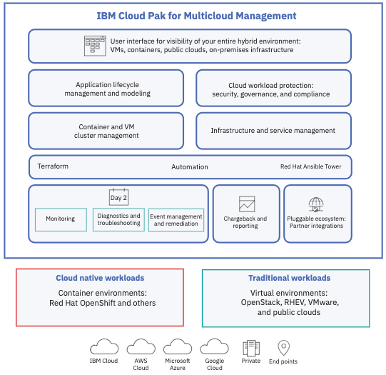

## Solution Overview
The IBM Cloud Pak™ for Multicloud Management 2.0, running on Red Hat® 
OpenShift®, provides consistent visibility, governance and automation
over applications and infrastructure running on a range of platforms,  
from cloud providers, on premise, and to the edge. Enterprises gain 
capabilities such as 
multicluster management, event management, application management and 
infrastructure management. Enterprises can leverage this IBM Cloud Pak 
to help increase operational efficiency driven by intelligent 
data analysis and predictive golden signals, and gain built-in support 
for compliance management.

The IBM Cloud Pak for Multicloud Management is a set of open, pluggable 
tools built around a core application and governance model. This core 
architecture helps organizations model applications and application 
dependencies, manage the lifecycles of both applications and infrastructure, 
consistently govern and secure applications and their deployment models; 
and deliver observability for the application’s full stack.

The major capabilities of Cloud Pak for Multicloud Management are as follows:
- **Infrastructure Management** 
   - Shortening the time to provision clusters and VMs across on-premise,
   public and private cloud environments
   - Creating repeatable templates for common infrastructure requests.
   - Enabling self-service catalogs
   - Scaling infrastructure automatically based on demand
- **Hybrid Application Management**
   - Modeling application dependencies across deployment platforms
   - Viewing applications consistently across deployment platforms
   - Scaling applications based on demand
   - Monitoring application performance
- **Protecting and Securing IT Investments**
  - Enabling chargeback for using departments
  - Enforcing corporate policies around security and compliance
  - Using existing IT Investments
  - Pluggable interface for new partner tools
- **Automating with Data and Machine Learning**
  - Building automated steps when something occurs
  - Knowing when events occur

<ul>
</ul>

This section provides documentation for:
1. Installing the Cloud Pak for Multicloud Management on Red Hat 
OpenShift on IBM Cloud.
2. A set of common use cases and how to demonstrate them. (Coming soon for 2.0)

## Cloud Pak for MCM 2.0 Component Architecture

## Other Resources

Throughout the IBM Cloud Pak Playbook site, the final authority
on how to install and configure the IBM Cloud Paks is the 
[IBM Knowledge Center](https://www.ibm.com/support/knowledgecenter/)
documentation. The link to the Knowledge Center for Cloud Pak for 
Multicloud Management 2.0 is below.

* <a href="https://www.ibm.com/support/knowledgecenter/en/SSFC4F_2.0.0/kc_welcome_cloud_pak.html">Cloud Pak for MCM 2.0 Knowledge Center</a>

* <a href="https://www.ibm.com/demos/collection/Cloud-Pak-for-Multicloud-Management/">IBM Demos (Videos, Product Tours and Hands on Labs)</a>
